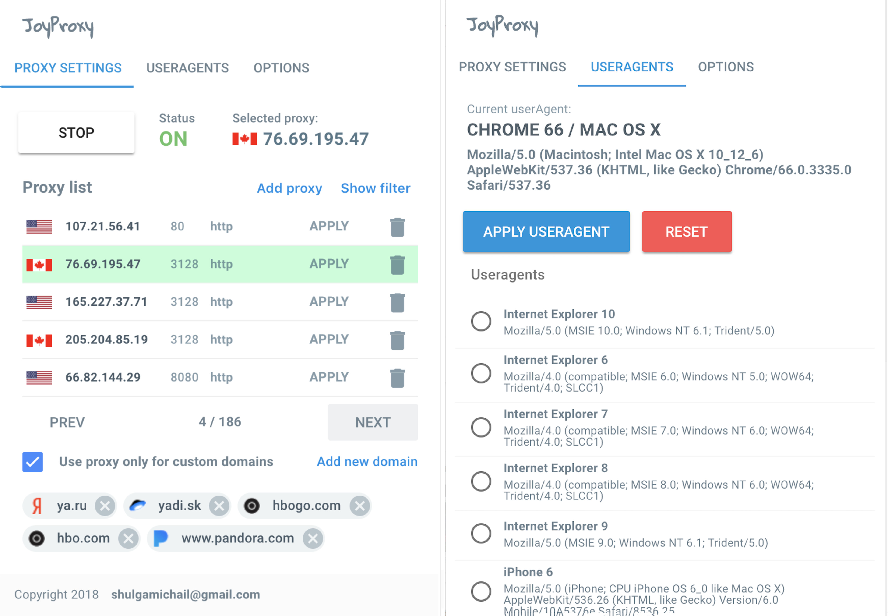

# JoyProxy
> Nice and smart browser extension for managing proxy

[https://chrome.google.com/webstore/detail/joyproxy/cfdjgedemlfeincnkcmhegbgkicofekg?hl=en-US](https://chrome.google.com/webstore/detail/joyproxy/cfdjgedemlfeincnkcmhegbgkicofekg/?hl=en-US)
JoyProxy - chrome extension for managing proxy settings. 
You can add your own proxy servers and use proxy only for your custom domains
Also it can change default browser's useragent



## Installation

1. Clone repo
2. run ```npm install```
3. run ```npm run build```
2. goto 'chrome://extensions' in Chrome
3. Click 'load unpacked extension'
4. Pick the "dist" folder
6. Click on extension icon

By default extension use this proxy list 
[https://raw.githubusercontent.com/fate0/proxylist/master/proxy.list](https://raw.githubusercontent.com/fate0/proxylist/master/proxy.list)

## Release History
* 0.0.1
    * Alpha version


## Contributing

1. Fork it (<https://github.com/sh0cked/joy-proxy/fork>)
2. Create your feature branch (`git checkout -b feature/fooBar`)
3. Commit your changes (`git commit -am 'Add some fooBar'`)
4. Push to the branch (`git push origin feature/fooBar`)
5. Create a new Pull Request

