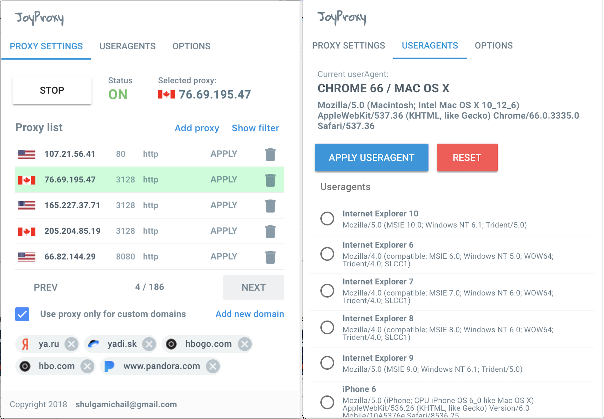

# JoyProxy
> Nice and smart browser extension for managing proxy

JoyProxy - browser extension for managing proxy settings. 
You can add your own proxies and apply proxy only for custom domains
Also it can change browser's default useragent



## Installation

1. Clone repo
2. run ```npm install```
3. run ```npm run build```
2. goto 'chrome://extensions' in Chrome
3. Click 'load unpacked extension'
4. Pick the "dist" folder
6. Click on extension icon

## Usage example

Useful if you'd like to for some websites, which are restricted in your country


## Release History
* 0.0.1
    * Alpha version

## Meta

Misha Shulga – shulgamichail@gmail.com

Distributed under the XYZ license. See ``LICENSE`` for more information.

[https://github.com/sh0cked/joyproxy](https://github.com/sh0cked/joyproxy/)

## Contributing

1. Fork it (<https://github.com/sh0cked/joyproxy/fork>)
2. Create your feature branch (`git checkout -b feature/fooBar`)
3. Commit your changes (`git commit -am 'Add some fooBar'`)
4. Push to the branch (`git push origin feature/fooBar`)
5. Create a new Pull Request

